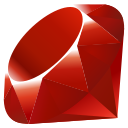
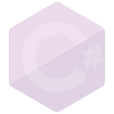
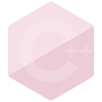

# 1 - Escreva na Tela "Hello World":

Escrever na tela "Olá Mundo!", são programas simples que servem como uma introdução ao aprendizado de uma linguagem de programação. Eles são usados principalmente como um primeiro exemplo de código em uma nova linguagem para demonstrar os conceitos básicos de sintaxe e estrutura.

Além disso, os "Olá Mundo!" também são úteis para verificar se o ambiente de desenvolvimento está configurado corretamente e funcionando. Esses programas são uma tradição comum na programação e servem como um ponto de partida para iniciantes explorarem os fundamentos de uma linguagem de programação.

## 1 - Printar texto com quebra de linha

<table id="01-01" align="center">
    <tr>
        <td align="center">
            
        </td>
        <td align="center">
            
        </td>
        <td align="center">
            
        </td>
        <td align="center">
            
        </td>
        <td align="center">
            
        </td>
        <td align="center">
            
        </td>
    </tr>
    <tr>
        <td align="center">
            
        </td>
        <td align="center">
            
        </td>
        <td align="center">
            
        </td> 
        <td align="center">
            
        </td>
        <td align="center">
            
        </td>
        <td align="center">
            
        </td>
    </tr>
</table>

## 2 - Printar texto sem quebra de linha

<table id="01-02" align="center">
    <tr>
        <td align="center">
            
        </td>
        <td align="center">
            
        </td>
        <td align="center">
            
        </td>
        <td align="center">
            
        </td>
        <td align="center">
            
        </td>
        <td align="center">
            
        </td>
    </tr>
    <tr>
        <td align="center">
            
        </td>
        <td align="center">
            
        </td>
        <td align="center">
            
        </td> 
        <td align="center">
            
        </td>
        <td align="center">
            
        </td>
        <td align="center">
            
        </td>
    </tr>
</table>

## 3 - Printar com formatação de texto

<table id="01-03" align="center">
    <tr>
        <td align="center">
            
        </td>
        <td align="center">
            
        </td>
        <td align="center">
            
        </td>
        <td align="center">
            
        </td>
        <td align="center">
            
        </td>
        <td align="center">
            
        </td>
    </tr>
    <tr>
        <td align="center">
            
        </td>
        <td align="center">
            
        </td>
        <td align="center">
            
        </td> 
        <td align="center">
            
        </td>
        <td align="center">
            
        </td>
        <td align="center">
            
        </td>
    </tr>
</table>

### [Voltar ao Menu Principal](../docs/LEIAME.md)