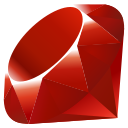

# Programming-Languages-Comparison-List

## A comparative list of scripting and compiled languages, with a simple code for beginners in 32 program languages !

This project is intended to be a small "Rosetta stone", containing a code comparison of several languages.
The idea is to work with the basics in each one, with the minimum necessary to be able to consult and get to know each language much more quickly.

To quickly get to what you want to see, you can select below where you want to go:

<html>

<nav id="#">
    

        <a href="#i0">Top</a>
        &nbsp;&nbsp;&nbsp;
        <a href="#i1">Hello World</a>
        &nbsp;&nbsp;&nbsp;
        <a href="#i2">Comments</a>
        &nbsp;&nbsp;&nbsp;
        <a href="#i3">Logic</a>
        &nbsp;&nbsp;&nbsp;
        <a href="#i4">Control Flow</a>
        &nbsp;&nbsp;&nbsp;
        
        &nbsp;&nbsp;&nbsp;
        <a href="#i6">I/O</a>
    

</nav>

## ABOUT THE LANGUAGES:

The languages are divided into two sets (Scripting or Compiled), with the focus on making it easier to show which language you can test more easily

Here you can see the logo of each language, where you can click on them to get to know them better:

<table id="#i0" border="2" align="center">
    <tr>
        <td colspan="34" align="center">ABOUT THE 32 LANGUAGES</td>
    </tr>
    <tr>
        <!--<td rowspan="2" align="center"></td>-->
        <td align="center">
            
        </td>
        <td align="center">
            
        </td>
        <td align="center">
            
        </td>
        <td align="center">
            
        </td>
        <td align="center">
            
        </td>
        <td align="center">
            
        </td>
        <td align="center">
            
        </td>
        <td align="center">
            
        </td>
        <td align="center">
            
        </td>
        <td align="center">
            
        </td>
        <td align="center">
            
        </td>
        <td align="center">
            
        </td>
        <td align="center">
            
        </td>
        <td align="center">
            
        </td>
        <td align="center">
            
        </td>
        <td align="center">
            
        </td>
    </tr>
    <tr>
        <td align="center">
            
        </td>
        <td align="center">
            
        </td>
        <td align="center">
            
        </td>
        <td align="center">
            
        </td>
        <td align="center">
            
        </td>
        <td align="center">
            
        </td>
        <td align="center">
            
        </td>
        <td align="center">
            
        </td>
        <td align="center">
            
        </td>
        <td align="center">
            
        </td>
        <td align="center">
            
        </td>
        <td align="center">
            
        </td>
        <td align="center">
            
        </td>
        <td align="center">
            
        </td>
        <td align="center">
            
        </td>
        <td align="center">
            
        </td>
    </tr>
</table>

## 0 - HELLO WORLD:

<table id="#i1" border="2" align="center">
    <tr>
        <td rowspan="3" align="center">A</td>
        <td colspan="33" align="left">Print "Hello World":</td>
    </tr>
    <tr>
        <td align="center">
            
        </td>
        <td align="center">
            
        </td>
        <td align="center">
            
        </td>
        <td align="center">
            
        </td>
        <td align="center">
            
        </td>
        <td align="center">
            
        </td>
        <td align="center">
            
        </td>
        <td align="center">
            
        </td>
        <td align="center">
            
        </td>
        <td align="center">
            
        </td>
        <td align="center">
            
        </td>
        <td align="center">
            
        </td>
        <td align="center">
            
        </td>
        <td align="center">
            
        </td>
        <td align="center">
            
        </td>
        <td align="center">
            
        </td>
    </tr>
    <tr>
        <td align="center">
            
        </td>
        <td align="center">
            
        </td>
        <td align="center">
            
        </td>
        <td align="center">
            
        </td>
        <td align="center">
            
        </td>
        <td align="center">
            
        </td>
        <td align="center">
            
        </td>
        <td align="center">
            
        </td>
        <td align="center">
            
        </td>
        <td align="center">
            
        </td>
        <td align="center">
            
        </td>
        <td align="center">
            
        </td>
        <td align="center">
            
        </td>
        <td align="center">
            
        </td>
        <td align="center">
            
        </td>
        <td align="center">
            
        </td>
    </tr>
</table>

## 1 - DECLARATIONS:
    1.1 - TYPES
    1.2 - VARIABLES
    1.3 - ARRAYS

## 2 - LOGIC STATEMENTS:
    2.1 - OPERATIONS (+,-,*,/);
    2.2 - <><=>=;
    2.3 - BOOLEAN;

## 3 - CONDITIONALS:
    3.1 -
    3.2 -
    3.3 -

## 4 - INPUT, OUTPUT
    4.1 -
    4.2 -
    4.3 -

</html>