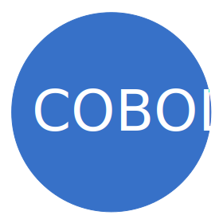
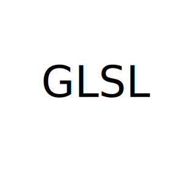
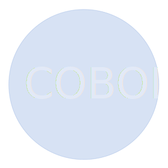
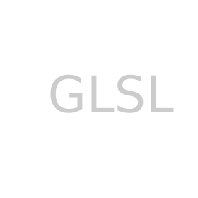

## Choice your speak language:

### [Português](Pages/1-Portugues/README-PTBR.md)

### If English, It´s here:

# Programming-Languages-Comparison-List

# In works

## A comparative list of scripting and compiled languages, with a simple code for beginners in 24 program languages !

This project is intended to be a small "Rosetta stone", containing a code comparison of several languages.
The idea is to work with the basics in each one, with the minimum necessary to be able to consult and get to know each language much more quickly.

## ABOUT This Project:

Here you can see the logo of each language, where you can click on them to get to know them better:

## 0 - About the languages:

<table id="00-00" border="2" align="center">
    <tr>
        <td colspan="2" align="left">Script</td>
        <td align="center">
            
        </td>
        <td align="center">
            
        </td>
        <td align="center">
            
        </td>
        <td align="center">
            
        </td>
        <td align="center">
            
        </td>
        <td align="center">
            
        </td>
        <td align="center">
            
        </td>
        <td align="center">
            
        </td>
    </tr>
    <tr>
        <td colspan="2" align="left">Alto Nível</td>
        <td align="center">
            
        </td>
        <td align="center">
            
        </td>
        <td align="center">
            
        </td>
        <td align="center">
            
        </td>
         <td align="center">
            
        </td>
        <td align="center">
            
        </td>
        <td align="center">
            
        </td>
        <td align="center">
            
        </td>
    </tr>
    <tr>
        <td colspan="2" align="left">Médio Nível</td>
        <td align="center">
            
        </td>
            <td align="center">
            
        </td>
        <td align="center">
            
        </td> 
        <td align="center">
            
        </td>
        <td align="center">
            
        </td>
        <td align="center">
            
        </td>
        <td align="center">
            
        </td>
        <td align="center">
            
        </td>
    </tr>
</table>

## 1 - [Print "Hello World!"](Pages/English/)

<table id="01-01" border="2" align="center">
    <tr>
        <td colspan="2" align="left">Script</td>
        <td align="center">
            
        </td>
        <td align="center">
            
        </td>
        <td align="center">
            
        </td>
        <td align="center">
            
        </td>
        <td align="center">
            
        </td>
        <td align="center">
            
        </td>
        <td align="center">
            
        </td>
        <td align="center">
            
        </td>
    </tr>
    <tr>
        <td colspan="2" align="left">Alto Nível</td>
        <td align="center">
            
        </td>
        <td align="center">
            
        </td>
        <td align="center">
            
        </td>
        <td align="center">
            
        </td>
         <td align="center">
            
        </td>
        <td align="center">
            
        </td>
        <td align="center">
            
        </td>
        <td align="center">
            
        </td>
    </tr>
    <tr>
        <td colspan="2" align="left">Médio Nível</td>
        <td align="center">
            
        </td>
            <td align="center">
            
        </td>
        <td align="center">
            
        </td> 
        <td align="center">
            
        </td>
        <td align="center">
            
        </td>
        <td align="center">
            
        </td>
        <td align="center">
            
        </td>
        <td align="center">
            
        </td>
    </tr>
</table>

## 2 - [Conceitos Fundamentais de Programação](Pages/English/)

## 3 - [Estruturas de Controle](Pages/English/)

## 4 - [Entrada e Saída de Dados](Pages/English/)

## 5 - [Módulos internos](Pages/English/)

## 6 - [Estrutura de dados](Pages/English/)

## 7 - [Paradigmas](Pages/English/)

## 8 - [Técnicas Gerais](Pages/English/)

## 9 - [Bibliotecas e Módulos](Pages/English/)

## 10 - [Algoritmos](Pages/English/)

## 11 - [Padrões de Projeto](Pages/English/)

## 12 - [Projetos](Pages/English/)

